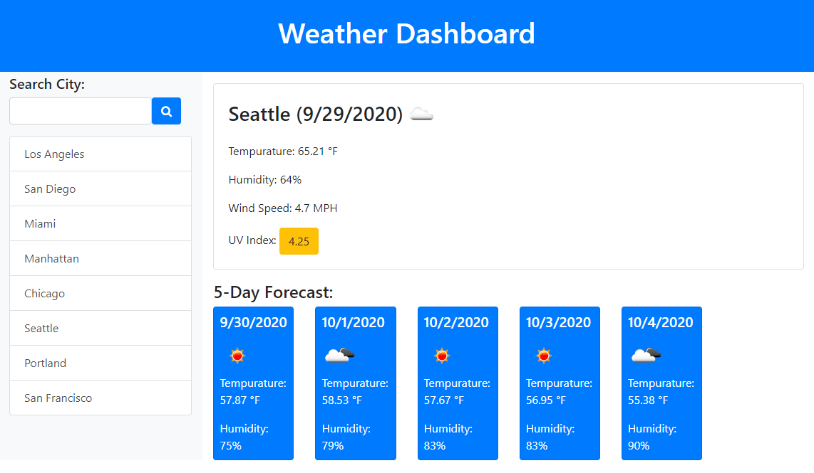
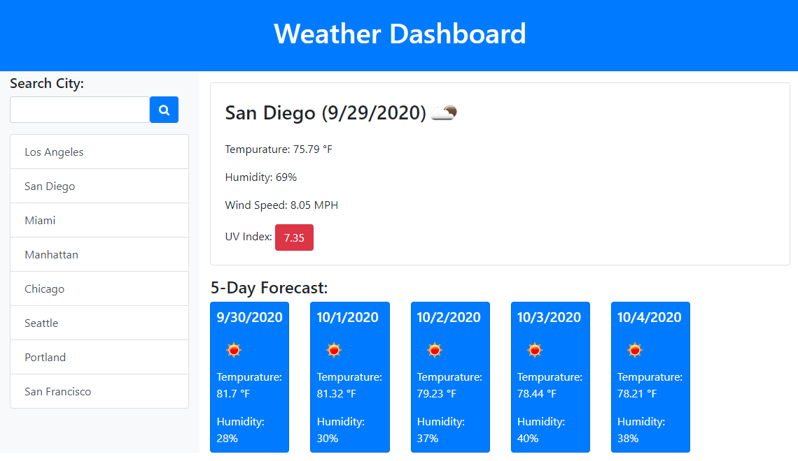
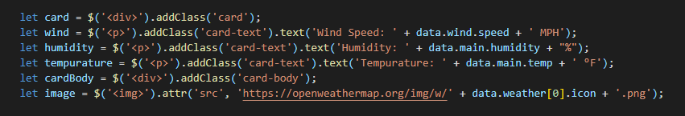

# Weather Dashboard

This Weather Dashboard was created as a quick snapshot for travelers to view the weather outlook for multiple cities to fun trips accordingly.

As shown in the images below, When searching for a specific city, the current and future conditions will appear and will be added to the search history for quick future reference. Each city's weather report will display on the dashboard with the city name, date, icon representation of weather conditions, tempurature, humidity, wind speed, and UV index with corresponding color that indicates whether the conditions are favorable, moderate, or severe.

 

 

 

## Coding Process

Using the OpenWeather API, the dashboard retrieves weather data for cities. The Weather Dashboard runs in the browser and features dynamically updated HTML and CSS using jQuery. 

See the code below on how I created html elements using jQuery.

 

To view the live website, please navigate to the **Deployed Link** below or  [click here](https://christyglee.github.io/weather-dashboard/) to view the page.

 

## Powered By

* [HTML](https://developer.mozilla.org/en-US/docs/Web/HTML)
* [Javascript](https://developer.mozilla.org/en-US/docs/Web/JavaScript)
* [jQuery](https://jquery.com/)
* [Bootstrap](https://getbootstrap.com/)
* [OpenWeather API](https://openweathermap.org/api))

 

### Other Resources Used

* [Visual Studio Code](https://code.visualstudio.com/)
    * [How to install VS Code](https://code.visualstudio.com/docs/setup/setup-overview)
* [GitBash](https://gitforwindows.org/)
    * [Download GitBash for Windows](https://git-scm.com/downloads)

 

## Deployed Link

* [See Live Site](https://christyglee.github.io/weather-dashboard/)

 

## Author
**Christy Lee** 

- [Github](https://github.com/christyglee)
- [LinkedIn](https://www.linkedin.com/in/christy-lee-95943748/)

  

## Acknowledgments

* [Google-Fu](https://www.google.com)
* [w3schools](https://www.w3schools.com/)
* [Stack Overflow](https://stackoverflow.com/search?q=over)
* [Bootstrap](https://getbootstrap.com/)
* [OpenWeather](https://openweathermap.org/)
* [jQuery](https://jquery.com/)